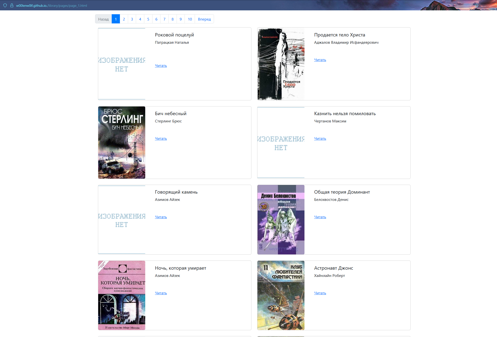

# 📚 Генератор HTML-страниц для библиотеки

Этот учебный проект генерирует многостраничный HTML-сайт на основе JSON-файла с книгами и HTML-шаблона. Встроен LiveReload-сервер для автоматического изменения содержимого при изменении данных или шаблона.

---
## 📘 Инструкция для чайников

Чтобы просмотреть сгенерированные страницы:

Откройте папку проекта и перейдите в папку pages.

Найдите файл page_1.html.

Дважды щёлкните по файлу — он откроется в браузере по умолчанию.

Если файл не открывается:

Щёлкните правой кнопкой мыши по файлу.

Выберите «Открыть с помощью» и выберите браузер (например, Google Chrome).

Теперь вы можете просматривать страницы, переходя по ссылкам «Вперёд» и «Назад» внизу страницы.


## ⚙️ Требования

- Python 3.7+
- Установка зависимостей:

```bash
pip install requirements.txt
```

---

## 🚀 Как использовать

1. Убедитесь, что у вас есть:
   - `meta_data.json` — файл с данными о книгах.
   - `template.html` — HTML-шаблон для генерации страниц.

2. Запустите скрипт:

```bash
python main.py
```

3. Введите пути к файлам при запросе или нажмите `Enter` для использования значений по умолчанию:
   - `meta_data.json`
   - `template.html`

4. После запуска откроется браузер по адресу:

```
http://localhost:5500
```

Сайт будет автоматически обновляться при изменении шаблона или данных.

---


---

## 🌐 Онлайн-версия

Открой страницу прямо сейчас:

🔗 [Посмотреть сайт](https://w00lenw0lf.github.io/library_ver2/pages/page_1.html)

---

## 🖼️ Скриншот



## 📁 Структура

```
├── main.py               # основной скрипт
├── template.html         # HTML-шаблон страницы
├── meta_data.json        # данные о книгах
├── pages/                # сгенерированные HTML-страницы
└── media/                # обложки книг и PDF-файлы
```

---

## 📘 Формат `meta_data.json`

```json
[
  {
    "title": "Пример книги",
    "author": "Автор Имя",
    "img_src": "обложка 1.jpg",
    "book_path": "Пример книги.pdf",
    "genres": "Фантастика, Приключения"
  }
]
```

---

## 💡 Особенности

- Поддержка URL-кодирования путей к файлам (например, кириллица, пробелы)
- Автоматическая разбивка на страницы по `BOOKS_PER_PAGE` книг
- Bootstrap для красивой разметки
- Автогенерация в папку `pages/`

---

## 🧹 Очистка

Чтобы пересоздать страницы с нуля:

```bash
rm -rf pages/
python main.py
```